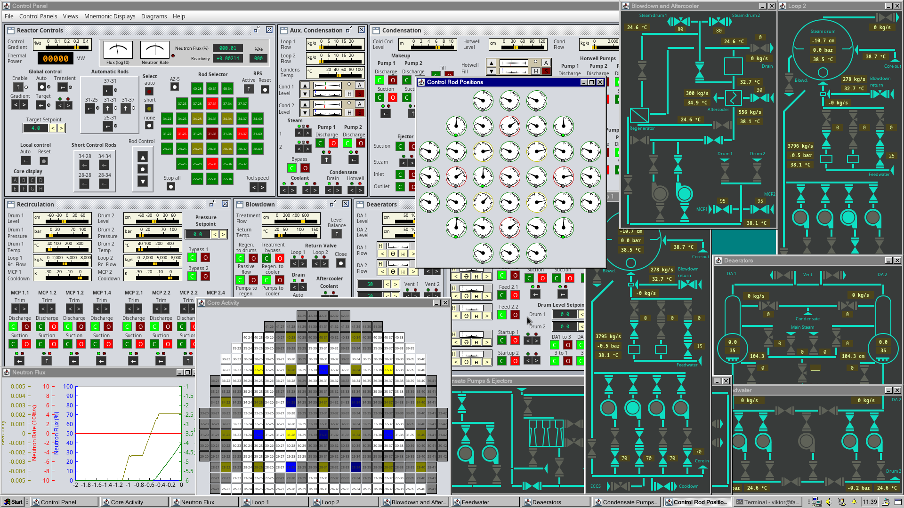

# RBMK Simulator
A simulator app for the chornobyl RBMK recator. This aims to be a successor for 
the Simgenics rxmodel simulator from about 30 years ago but with a lot more 
detailed systems and a more accurate representation of the chernobyl plant.

**This is work in progress. The development is still in a very early stage.**

The app aims to be usable in real time on average to low end computers. It does 
not require high performance hardware.



## Installation and Usage
Download: 
[RbmkSimulator-SNAPSHOT.jar](https://github.com/hartrusion/RbmkSimulator/releases/download/github-ci-snapshot/RbmkSimulator-SNAPSHOT.jar)

Using this link downloads the latest automated build (also found in 
[Releases](https://github.com/hartrusion/RbmkSimulator/releases) as
_github-ci-snapshot_). It always points to the current development state and 
will be replaced automatically each time I change something. You might find a 
new file there from time to time.

Plase note that save files do not have any compatibility between versions 
implemented. It is possible to load old saves on newer simulator releases but 
some newer components will not get a proper initialization so you end up in a 
plat state that you would not reach normally.

<details>
  <summary>This is a Java application. Expand this section (just click here) 
  if you want to read more about this and don't know what to do with 
  a .jar file.</summary>
  
  You need a Java Runtime (at least v17.0.17) to run a .jar file. A jar file 
  is an archive file that can contain something for java to run.

  To check if you already have java installed and configured on your system, 
  type
  ```
  java -version
  ```
  in Command Line or Terminal. It will return which version is installed or an
  error if there is no java available. In this case you have to download this
  by yourself.

  Any recent OpenJDK has a Runtime included, you can go for Eclipse Adoptium or
  the Microsoft Build of OpenJDK or any other of those. Just do not use the 
  Oracle/Sun Java JRE you will find at java.com as this is the old Version 8.
  If you're a Linux user, you should not have any issues getting a java runtime 
  for your distribution.

  To run the Simulator, simply run the. jar with the Java Runtime. You could 
  open a terminal and run
  
      java -jar RbmkSimulator-SNAPSHOT.jar
  
  Running in Terminal allows you to see additional log output (which is not 
  needed for operating the plant).

  **Why this? Why not a simple .exe file?** It is not uncommon to need some kind 
  of Runtime to run a program, you might also know .NET or Visual Studio Runtime 
  which are needed for some programs also. Java is a bit different but has the 
  huge advantage that it works on multiple plattforms with almost the same 
  behavior. While it had a bad reputation for end users due to some security 
  issues and a really bad installer behaviour (who the hell installs Toolbars),
  it is nowadays used a lot for backend server side apps and one of the most 
  popular programming languages. It gained some reputation with Minecraft at 
  non programmer end users in the last years.
</details>

You can find a short [Operating Manual](docs/OPERATING_MANUAL.md) here.

## Focus
Operating a power plant requires the operators to consider a large amount of 
data describing the actual plant stage and operate the correct valves, pumps 
or other elements. This simulator focuses on control loops, alarms and mainly 
the thermal layout of the plant to make you as an operator control all those
systems. To keep things simple, many systems are either simplified or they are 
not present at all.

## Features (and simplifications)
* Two steam drum separators (instead of 4)
* Simplified reactor with 5 automatic, 28 manual and 4 short control rods.
* Automatic reactor power regulator that requires manual overrides from time to
time.
* Reactor with nasty features, has some surprises on low power levels and the
accident can be triggered.
* Accident sequence (prompt neutron excursion) possible.
* One turbogenerator set with steam reheater.
* Mnemonic displays with additional measurement data on them.
* Some line plots to monitor measurement time series.

## Build from Source
To build the simulator from source, you need the source code from this repo
and some additional code that is released on different repositories:
* [PhxNetMod](https://github.com/hartrusion/PhxNetMod) Simulation Engine
* [PhxNetModExt](https://github.com/hartrusion/PhxNetModExt) Extensions for 
control loops
* [Utils](https://github.com/hartrusion/utils) Some commonly used classes
* [JMPLot](https://github.com/hartrusion/jmplot) A Matlab-like line plot library
* [AbsoluteLayout](https://mvnrepository.com/artifact/org.netbeans.external/AbsoluteLayout)
GUI Layout extension for Swing (this comes packed with NetBeans)

The GUI is designed using NetBeans GUI builder, those classes can be used 
with different IDEs but once edited outside of NetBeans, they propably won't
work anymore.

## Getting involved
As this project is in a very early stage, there are still a few architecture 
and design decissions to be made so things might still change a lot. There 
are lots of systems missing and not working.

Please make yourself familiar with the rather unusual
[Code of Conduct](./CODE_OF_CONDUCT.md) first and read the
[Contributing](./CONTRIBUTING.md) guidelines.

I did not set up antything for contributing for now, but if you're a senior
java dev and you have some suggestions, feel free to open a discussion or 
issue.

No Z supporters wanted.

## Licencing and usage
I decided to publish this simulator with GPLv3 so this thing is free software. 
As I've also put in lots of thoughts on how to represent the plant with the 
GUI, I do want to keep the authorship and control over it. You can use and 
redistribute this software as you like, there are only some limitations if 
you would like to modify and publish the software again.

To make it possible to share the developed technology, large parts of the code 
in other repositories are published with MIT licence so you're free to reuse 
those parts for whatever you like without such limitations.

## Modeling engine
The simulation is based on the PhxNetMod project which implements the theory of 
having similar linear ordinary differential equations in electronics, mechanics, 
hydraulics and thermal systems. The methods of network analysis can therefore 
be applied to other domains. The PhxNetMod core, along with other dependencies,
are available as separate projects.
