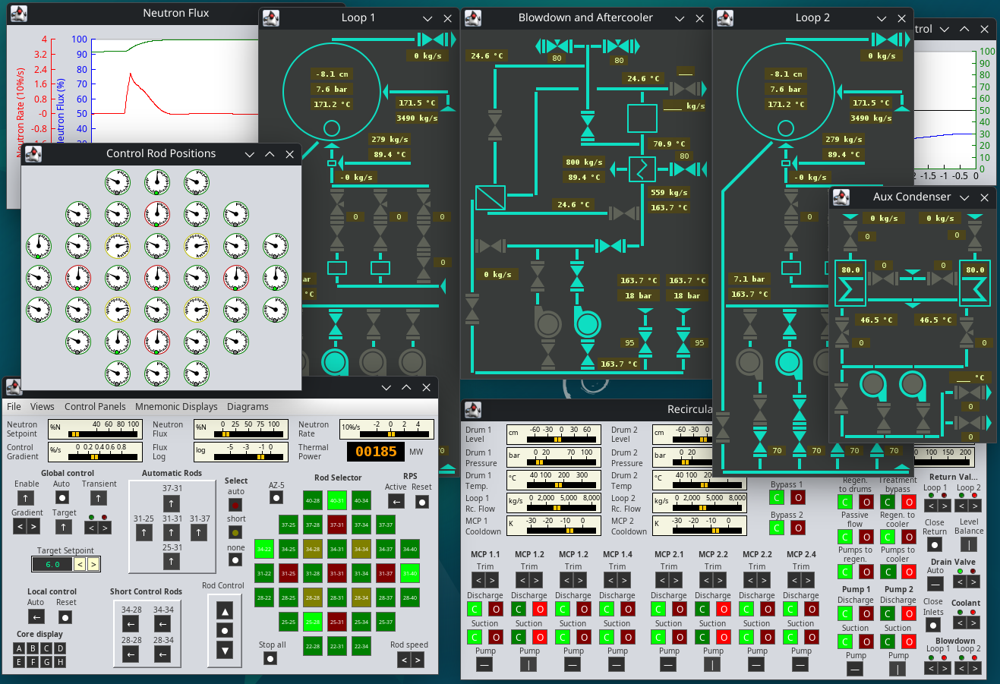

# RBMK Simulator
A simulator app for the chornobyl RBMK recator. This aims to be a successor for 
the famous RXMODEL simulator from about 30 years ago but with a lot more 
detailed systems and a more accurate representation of the chernobyl plant.

**This is work in progress. The development is still in a very early stage.**

## Focus
Operating a power plant requires the operators to consider a large amount of 
data describing the actual plant stage and operate the correct valves, pumps 
or other elements. This simulator focuses on control loops, alarms and mainly 
the thermal layout of the plant. To keep things simple, many systems are either 
simplified or they are not present at all.

Why Java? Java might be the worst choice for real time applications, but it
provides very convenient ways of using object orientated programming and runs on
a variety of computers, providing the same experience over different 
architectures and operating systems. And, if used properly, it is actually fast.

## Features (and simplifications)
* Two steam drum separators (instead of 4)
* Simplified reactor with 5 automatic, 28 manual and 4 short control rods.
* Automatic reactor power regulator that requires manual overrides from time to
time.
* Reactor with nasty features, has some surprises on low power levels and the
accident can be triggered.
* Mnemonic displays with additional measurement data on them.
* Some line plots to monitor measurement time series

Still, there is lots of work to do, so currently there is **no turbine** and 
most coolant loops are connected to fixed cold water flow sources instead of 
having a secondary and technical coolant water circuit. It is not possible to 
operate the plant on full power as there is no turbine and no bypass at this
stage.

## Usage
To run the preview, download the jar-File on the releases section and run them 
with any decent up to date java runtime. I suggest you to get a recent build of 
OpenJDK for your operating system. If everything is installed properly, you 
can just double click the jar file.

## Getting involved
As this project is in a very early stage, lots of architecture and design 
decisions have to be made and major refactorings do occur. I do believe that 
contributions might not be that useful in this early stage.

Please make yourself familiar with the rather unusual
[Code of Conduct](./CODE_OF_CONDUCT.md) first and read
[Contributing](./CONTRIBUTING.md) guidelines.

Discussions about this particular project shall be discussed here on GitHub 
only.

## Modeling engine
The simulation is based on the PhxNetMod project which implements the theory of 
having similar linear ordinary differential equations in electronics, mechanics, 
hydraulics and thermal systems. The methods of network analysis can therefore 
be applied to other domains. The PhxNetMod core, along with other dependencies,
are available as separate projects.
