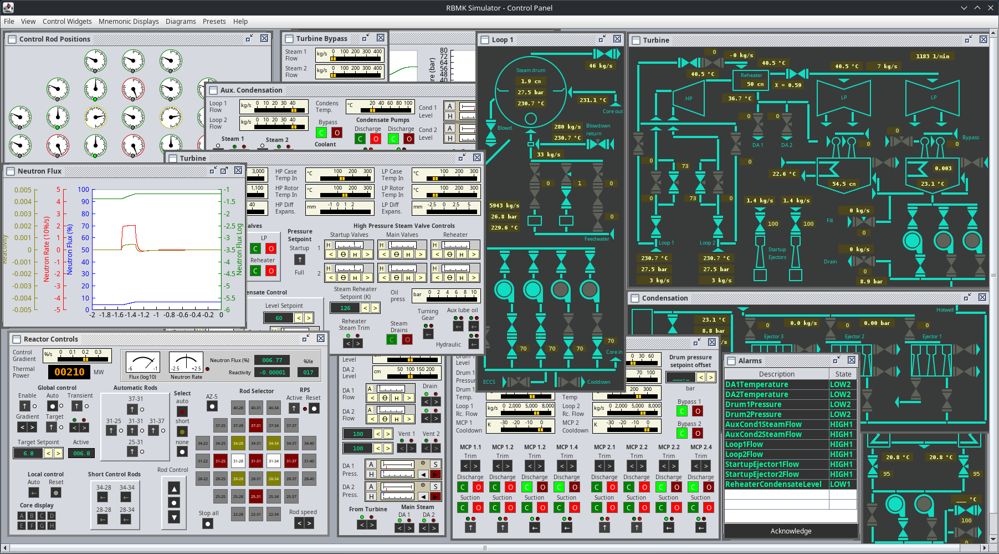

# RBMK Simulator
This is a simulator app for the Chornobyl RBMK Reactor. Heavily inspired by the 
[Simgenics rxmodel simulator](https://github.com/gdzx/chernobyl-simulator) 
from about 30 years ago but with a lot more detailed systems and a more accurate 
representation of the chernobyl plant.

This simulation focuses on the thermo hydraulic systems and the general 
operation of power plants. It has no accurate neutron simulation and has many 
systems simplified to allow running even on low end hardware.

For details on the usage and some rudimentary documentation, refer to the 
[Project Page](https://hartrusion.com/en/rbmk-simulator/) for more details. The 
manuals are updated from time to time

## Installation and Usage
This is a java application so it runs on pretty much every popular operating 
system. To download the simulator, go to 
[Latest Release](https://github.com/hartrusion/RbmkSimulator/releases/latest)
here on Github. If you have no clue about Java and use a Windows computer, 
download the **RbmkSimulator-Windows-x64.zip** file there. It contains a .exe 
file that you can just run (no installation needed). If you have a different 
operating system or a java runtime/jdk already installed, you can download the 
**RbmkSimulator-SNAPSHOT.jar** file instead which is way smaller.

A current development snapshot can be downloaded here: 
[RbmkSimulator-SNAPSHOT.jar](https://github.com/hartrusion/RbmkSimulator/releases/download/github-ci-snapshot/RbmkSimulator-SNAPSHOT.jar). 
This gets updated more frequently each time I push changes to github.

Please not that save files are **NOT** compatible with newer versions.

## Getting involved
Please make yourself familiar with the rather unusual
[Code of Conduct](./CODE_OF_CONDUCT.md) first and read the
[Contributing](./CONTRIBUTING.md) guidelines.

There is a list of **missing features** and known problems in the 
[Issue](https://github.com/hartrusion/RbmkSimulator/issues) 
section, everything that is listed here is going to be fixed and implemented.

No Z supporters wanted.

## Licencing
I decided to publish this simulator with GPLv3 so this thing is free software. 
As I've also put in lots of thoughts on how to represent the plant with the 
GUI, I do want to keep the authorship and control over it and decided to use 
this more resticted licence. You can use and redistribute this software as you 
like, there are only some limitations if you would like to modify and publish 
the software again.

To make it possible to reuse the developed technology, large parts of the code 
in other repositories are published with the more permissive MIT licence so 
you're free to reuse those parts for whatever you like without such limitations.
