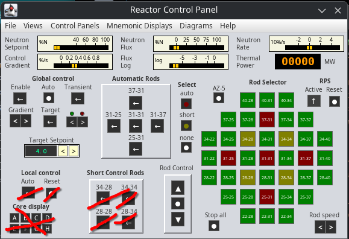
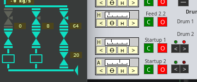
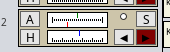
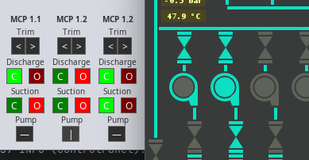

# Operation Manual

The simulation starts with the reactor control panel. Additional control panels 
and the mnemonic display views can be opened in the menu. Those windows can be 
arranged as needed.

**Please note that those widgets on the panels do look like the controls from 
the real control panel but their functionality is made up by my imagination.**

## Reactor operation

There are a total of 28 manual control rods, 5 automatic control rods and 4 
short rods from below.

Some words on that reactor controls. Things on the lower left do not work, 
those are not yet implemented. Those 5 switches below "Automatic Rods" select 
which rods should be used by the global control. 

The global control has a target setpoint and a setpoint for the rod control 
loop (upper left gauge). That loop setpoint ramps up to the target setpoint 
when the target and transient switches are on and the ramp can be set with the 
gradient switches. That allows to pause the transient. To start global control,
it needs to be enabled, rods need to be selected and then that "auto" button 
needs to be pressed to start controlling them. On the lower right with the two 
light bulbs (which do not work) is a manual override that will temporarily 
move all auto rods when pressed.

I have no idea if it worked like this but the power plant i worked in had a 
similar power setpoint control structure, just way more comfortable to use.

"File" - "Set core only mode" will disconnect the reactor model from the thermal
layout so nothing heats up and you can raise the neutron flux to 100 %. That 
also means no voiding feedback from the thermal model

## Valves

Some valves can be opened or closed only, those are operated with green and red
buttons. The button with the corresponding end position will light up as soon 
as the valve is open (red/in Operation) or closed (green/ready).

Other valves might be controlled by a control loop output (level control), there 
is a widget with four buttons for such valves. The indicator scale shows the 
current valve position. The two middle buttons switch between manual and auto 
mode, the outer buttons directly control the valves position. Active control 
loops are indicated with a lit up triangle on the mnemonic display. The valve 
control widget shows "H" on manual and "A" on auto mode.

Valves which can only be controlled manually have a smaller switch with two 
buttons and a red and green indicator above the switch. Their position has to 
be obtained from the mnemonics.

### Control Loop Widget
Sometimes, multiple valves do the same thing and have the same setpoint value.
In other cases, there might be a simple control loop with only one single valve 
and a setpoint just for that one valve. Such control loops can be controlled 
by a control loop widget.

The upper gauge shows the current value (green) and the setpoint value (red)
with the same scale. The lower gauge shows the current valve position, or any 
other output elements value. The A and H buttons toggle between auto and manual 
mode. Pressing the red "S" button will toggle setpoint mode. The left up and 
down buttons do control the valve manually or do a manual override. If setpoint 
mode is active, the left controls are used to modify the setpoint instead of 
the valve position.

## Switching Pumps

Centrifugal pumps have a valve on each side (suction and discharge). To turn on 
a pump, the discharge valve has to be closed. This ensures no reverse flow could
ever turn the pump when switching the motor on. This is enforced in the 
simulator. Each pump on the control panel can be found on a mnemonic display
showing the current pump state. The suction valve usually remains open and has 
to be opened before turning ont he pump.

A pump is ready to be turned on when the outline glows. Its startup sequence is 
indicated by a slight glow, a running pump is indicated with a glowing inner 
circle. Do not open the discharge valve before the pump is running.

## Alarms
Some values are attached to alarms which are triggered when above or below a 
certain level. There are **four** alarm thresholds available (not all of them 
need to be mapped to a vale) for each direction. The first two are considered 
warning and there is no consequence if they are appearing. The second two alarm 
thresholds are always connected to a certain event (valve operation, pump 
shutdown, ...).

For high values there is:

* HIGH1 - warning only
* HIGH2 - warning only
* MAX1 - Triggers an event
* MAX2 - Triggers an event

For low values there is:

* LOW1 - warning only
* LOW2 - warning only
* MIN1 - Triggers an event
* MIN2 - Triggers an event

Some elements also have a safety override implemented that prohibits opening or 
closing valves or switching on certain pumps.

This is not primarily done to ensure the plant's integrity, it is done because 
the modeling engine does not allow certain states and would otherwise crash.
